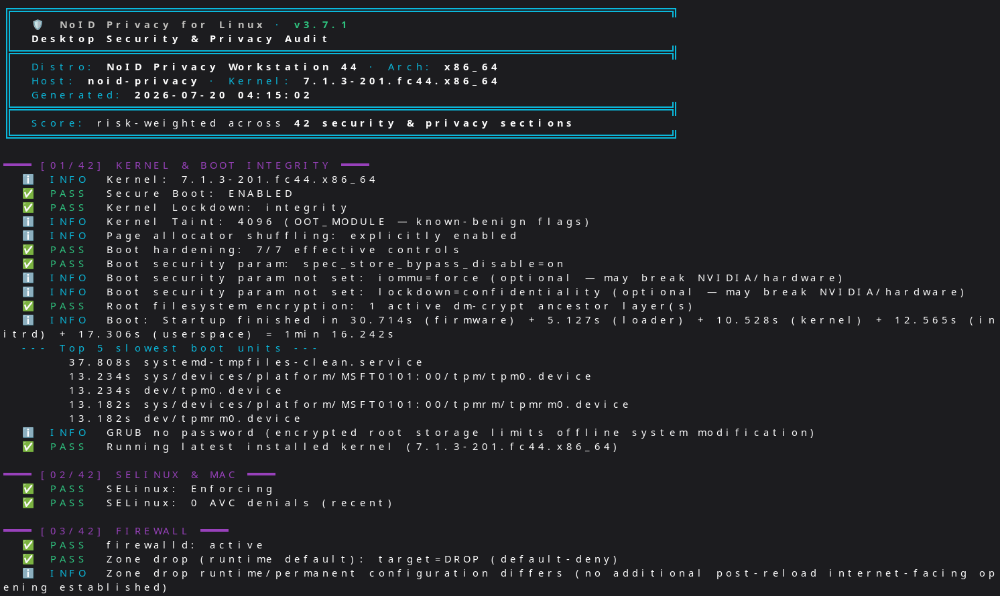

<div align="center">

# 🛡️ NoID Privacy for Linux

### Hardening Posture Audit for Linux Desktops

[](https://github.com/NexusOne23/noid-privacy-linux/blob/main/LICENSE)
[](https://github.com/NexusOne23/noid-privacy-linux/releases)
[](https://github.com/NexusOne23/noid-privacy-linux)
[](https://github.com/NexusOne23/noid-privacy-linux)
[](Docs/CHECKS.md)
[](https://github.com/NexusOne23/noid-privacy-linux/actions)
[](https://noid-privacy.com)

**42 risk-weighted sections · Pure Bash · Desktop security and privacy · Structured remediation prompts**

Validation status is recorded per release and environment in the [support matrix](Docs/SUPPORT.md).

[📥 Quick Start](#-quick-start) · [🔍 What it Checks](#-what-it-checks) · [🤖 AI Fixes](#-fix-with-ai) · [🧰 Related tools](#-how-it-fits-with-other-tools) · [💬 Discussions](https://github.com/NexusOne23/noid-privacy-linux/discussions)

</div>

<p align="center">
  <a href="Docs/screenshots/noid-linux-audit-3.7.1.png">
    
  </a>
</p>

<p align="center"><sub>Live NoID Privacy for Linux 3.7.1 audit output on Workstation 44 · click to enlarge</sub></p>

---

## ⚡ Quick Start

```bash
curl -fsSL https://github.com/NexusOne23/noid-privacy-linux/raw/main/noid-privacy-linux.sh -o noid-privacy-linux.sh
sudo bash noid-privacy-linux.sh --ai
```

The audit emits the checks that apply to the host across 42 sections; the
finding count therefore varies with hardware, installed tools, desktop, and
applicable configuration. The `--ai` flag generates a ready-to-paste prompt
from the FAIL/WARN findings for remediation suggestions. Review every
suggestion against your distribution's maintained documentation before
applying it.

> **Default audit mode is non-remediating and read-oriented.** It intentionally changes no configuration, restarts no services, and never refreshes package metadata. Invoked system services may still record ordinary resolver/daemon logs or access metadata. Explicit stateful paths are documented: the RPM baseline environment variables write `/var/lib/noid-privacy/rpm-baseline.txt`; `NOID_AIDE_LIVE=1` creates a protected temporary log and keeps it only on drift/error; NoID alone exposes the explicit `--refresh-noid-rpm-policy` operator workflow, which refuses to create trust state without a separately reviewed root-owned path list.

> **🪟 Running Windows too?** The GPL-3.0 [NoID Privacy](https://github.com/NexusOne23/noid-privacy) PowerShell engine and the [NoID Privacy](https://noid-privacy.com) website cover the sibling Windows offering.

## 🀄 中文簡介 | 中文简介

**繁體中文：** NoID Privacy for Linux 是純 Bash 的 Linux 桌面安全與隱私稽核工具，涵蓋 42 個風險加權區段；預設不修改系統設定，並提供 `--ai` 模式產生結構化修復提示（GPL-3.0）。中文介紹：[noid-privacy.com（繁體中文）](https://noid-privacy.com/linux-zh-hant.html#audit-tool)

**简体中文：** NoID Privacy for Linux 是纯 Bash 的 Linux 桌面安全与隐私审计工具，涵盖 42 个风险加权区段；默认不修改系统配置，并提供 `--ai` 模式生成结构化修复提示（GPL-3.0）。中文介绍：[noid-privacy.com（简体中文）](https://noid-privacy.com/linux-zh-hans.html#audit-tool)

---

## 🎯 Scope — What this IS / NOT

NoID Privacy is a **desktop posture audit**: it observes selected configuration
and runtime evidence. The score reflects only the assessed model, not
compromise resistance.

| ✅ This tool **does** | ❌ This tool does **not** |
|---|---|
| Verify hardening recipes are applied | Replace an Intrusion Detection System |
| Detect privacy misconfigurations | Prove that a host is free of malware |
| Report observed package/AIDE baseline drift | Inventory every applicable CVE |
| Generate AI remediation prompts | Perform penetration testing or vulnerability scanning |
| Audit 42 desktop-specific surfaces | Behavioral / memory-only malware detection |

**A high score means no adverse result was found in much of the assessed scope;
it is not evidence that the system is uncompromised.** Always read the separate
risk-weight coverage value and the individual findings. Defense in depth
requires complementary layers:

- **Layer 1** ✅ Configuration Hardening *(this tool)*
- **Layer 2** ➕ Integrity Detection *(AIDE, IMA, signed package verification)*
- **Layer 3** ➕ Behavioral Monitoring *(auditd, EDR)*

Configuration is the foundation. The other layers detect what hardening cannot prevent.

---

## 🤔 Why This Exists

General host audits and compliance baselines are valuable, but a workstation
also has user-session and privacy boundaries. NoID focuses on the intersection:
browser and desktop policy, application telemetry, local data traces, session
locking, removable media, Bluetooth/webcam exposure, DNS/VPN observations, and
the underlying host controls. It is intended to complement, not replace, a
general host audit or formal benchmark scanner.

---

## 🤖 Fix with AI

The prompt is an optional hand-off format, not an automated remediation engine:

```bash
sudo bash noid-privacy-linux.sh --ai
```

The `--ai` flag generates a **structured prompt** containing the observed
FAIL/WARN findings and sanitized system context. A model can explain findings
and propose commands, but its output is untrusted advice: verify scope, package
names, paths, rollback, and distribution guidance before changing the system.

```bash
# AI remediation prompt (recommended)
sudo bash noid-privacy-linux.sh --ai

# Plain text for manual review
sudo bash noid-privacy-linux.sh --no-color > report.txt

# Machine-readable JSON for scripts/dashboards
sudo bash noid-privacy-linux.sh --json
```

The audit itself never sends the prompt or report to a model provider.

---

## 📋 What it Checks

### 🛡️ Security (Sections 01–34)

| Category | Examples |
|---|---|
| **Kernel & Boot** | Secure Boot, kernel lockdown, root block-stack encryption, UEFI, sysctl hardening |
| **Firewall & Network** | iptables/nftables rules, default policies, open ports, VPN, kill-switch, DNS routing/egress consistency |
| **SSH & Auth** | Key-only auth, root login, password aging, PAM, sudo group |
| **Encryption** | LUKS cipher strength, key size, swap encryption, entropy, certificate store |
| **MAC & Integrity** | SELinux/AppArmor (auto-detected), rootkit scans, AIDE/Tripwire, package verification |
| **Updates & Packages** | Security patches, auto-updates, repo integrity, GPG verification (dnf/apt/pacman/zypper) |
| **Advanced** | Fail2Ban, USB Guard, containers, systemd sandboxing, kernel modules |

### 🔒 Privacy & Desktop (Sections 35–42)

| Category | Examples |
|---|---|
| **Browser Privacy** | Firefox telemetry, VPN-aware WebRTC exposure, DNS-over-HTTPS, tracking protection, Chromium-family inventory |
| **App Telemetry** | GNOME telemetry, crash reporters, Flatpak sandbox escapes, Snap telemetry |
| **Network Privacy** | MAC randomization, mDNS, LLMNR, hostname privacy, IPv6 privacy extensions |
| **Data Privacy** | Recent file tracking, thumbnail caches, core dumps, bash history, journald retention |
| **Session Security** | Screen lock, idle detection, auto-login, lock-on-suspend, VNC/RDP |
| **Webcam & Audio** | Device permissions, microphone, PipeWire remote access, screen sharing |
| **Bluetooth** | Discoverability, pairable mode, active without usage |
| **Keyring & Secrets** | Password manager, GNOME Keyring auto-unlock, SSH agent timeout, permission review for potential secret filenames |

📖 **[Full Check Reference →](Docs/CHECKS.md)** — all 42 sections with descriptions

Design inputs and rejected/deferred imports from Lynis, CIS, STIG, SCAP, and
NIST are recorded in the [external control review](Docs/REFERENCE_REVIEW.md).

---

## 📸 Sample Output

Illustrative, abridged output is shown below. Exact findings, labels, counts,
score, and coverage depend on the assessed host.

```
$ sudo bash noid-privacy-linux.sh --ai

╔══════════════════════════════════════════════════════════════════════╗
║  🛡️  NoID Privacy for Linux · v3.7.1
║  Desktop Security & Privacy Audit
╠══════════════════════════════════════════════════════════════════════╣
║  Distro: Fedora Linux 43 (Workstation Edition) · Arch: x86_64
║  Host: workstation-01 · Kernel: 6.19.x-200.fc43.x86_64
║  Generated: YYYY-MM-DD HH:MM:SS
╠══════════════════════════════════════════════════════════════════════╣
║  Score: risk-weighted across 42 security & privacy sections
╚══════════════════════════════════════════════════════════════════════╝

━━━ [01/42] KERNEL & BOOT INTEGRITY ━━━
  ✅ PASS  Secure Boot: ENABLED
  ✅ PASS  Kernel Lockdown: integrity
  ✅ PASS  Root filesystem encryption: 1 active dm-crypt ancestor layer(s)

━━━ [05/42] VPN & NETWORK ━━━
  ✅ PASS  VPN interface wg0: active
  ✅ PASS  VPN full-tunnel default route present: default dev wg0
  ✅ PASS  IPv6: disabled/minimal (1 addresses: loopback=1)

━━━ [35/42] BROWSER PRIVACY ━━━
  ✅ PASS  Firefox telemetry disabled [profile-1]
  ✅ PASS  WebRTC disabled — WebRTC address exposure prevented [profile-1]
  ⚠️  WARN  Tracking protection not strict (standard) [profile-1]

━━━ SUMMARY ━━━
╔══════════════════════════════════════════════════════════════════════╗
║                            FINAL RESULTS                             ║
╠══════════════════════════════════════════════════════════════════════╣
║  Total findings:      167 (112 pass, 2 fail, 8 warn, 45 info)
║  ✅ Passed:           112
║  🔴 Failed:             2
║  ⚠️  Warnings:           8
║  ℹ️  Info:             45
╠══════════════════════════════════════════════════════════════════════╣
║  Posture describes observed configuration, not compromise resistance.
║  Complement this evidence with:
║    ✓ AIDE / IMA   — file & kernel integrity
║    ✓ auditd       — behavioral monitoring
║    ✓ chkrootkit   — known-malware heuristics
╠══════════════════════════════════════════════════════════════════════╣
║  Risk-weight coverage: 91% (91/100 points assessed)
║  DESKTOP POSTURE SCORE:       84% 🟡 MODERATE POSTURE
║  Scoring:           42 risk-weighted security & privacy sections
║  Details:           Docs/SCORING.md · not certification
╚══════════════════════════════════════════════════════════════════════╝

Exit codes: 0 = no FAIL/WARN · 1 = FAIL present · 2 = WARN-only · 130/143 = interrupted
```

---

## ⚙️ Options

| Flag | Description |
|------|-------------|
| `--ai` | Generate a local remediation prompt from FAIL/WARN findings |
| `--json` | Machine-readable JSON output |
| `--no-color` | Disable colored output (for piping/logging) |
| `--verbose`, `-v` | Show every individual PASS (boot params, sysctl) instead of aggregated summaries |
| `--offline` | Skip outbound DNS/connectivity/leak probes and the optional live Arch advisory lookup while retaining local VPN configuration checks |
| `--skip SECTION` | Skip specific sections (repeatable) |
| `--cis-l1` / `--cis-l2` / `--stig` | Append a CIS RHEL 9 / DISA STIG coverage report at the end |
| `--version` | Show the program version and exit |
| `--help` | Show all available options and skip keywords |

44 skip keywords are available: 42 sections plus the `netleaks` and `summary`
virtual flags. Run `--help` for the full list.

---

## 📊 How it fits with other tools

| Tool / content | Primary role | Relationship to NoID |
|---|---|---|
| **NoID Privacy for Linux** | Desktop security/privacy posture and structured local findings | This repository; not a certification or malware verdict |
| [**Lynis**](https://cisofy.com/lynis/) | Broad Unix/Linux host auditing and hardening suggestions | Run alongside NoID for another implementation and wider general-host perspective |
| **CIS / DISA content via CIS-CAT or [OpenSCAP](https://www.open-scap.org/)** | Versioned benchmark evaluation | Use for formal baseline assessment; NoID exposes only a conservative static cross-reference |
| **AIDE / IMA** | File or runtime integrity evidence | Complements configuration posture and requires an operator-owned trusted baseline/policy |
| **chkrootkit / rkhunter** | Signature and heuristic indicators | Optional context only; a clean result is not proof of integrity |
| [**privacy.sexy**](https://privacy.sexy) | Reviewable remediation-script generation | Different change-oriented workflow; validate changes independently |

Scores and finding counts from these tools are not interchangeable. See the
reviewed [CIS/STIG mapping](Docs/CIS_RHEL9_MAPPING.md).

---

## 📥 Installation

| Requirement | Details |
|---|---|
| **OS** | See the release-specific [support and validation matrix](Docs/SUPPORT.md) |
| **Shell** | Bash 4.3+ |
| **Privileges** | Root (`sudo`) for full system access |
| **Commands** | Common distribution utilities; unavailable optional tools reduce coverage rather than being installed by the audit |

```bash
# One-liner
curl -fsSL https://github.com/NexusOne23/noid-privacy-linux/raw/main/noid-privacy-linux.sh -o noid-privacy-linux.sh
sudo bash noid-privacy-linux.sh --ai

# Or clone
git clone https://github.com/NexusOne23/noid-privacy-linux.git
cd noid-privacy-linux
sudo bash noid-privacy-linux.sh --ai
```

---

## 🚀 GitHub Action

Use NoID Privacy for Linux in your CI/CD pipeline to enforce privacy & security baselines:

Pin the action to the reviewed `v3.7.1` release tag; a full commit SHA provides
stronger immutability for higher-assurance workflows.

```yaml
- name: Hardening Posture Audit
  # Pin to a reviewed release; a full commit SHA is stronger than a tag.
  uses: NexusOne23/noid-privacy-linux@v3.7.1
  id: audit
  with:
    min-score: '70'      # Posture within assessed scope
    min-coverage: '75'   # Fixed risk weight with assessed evidence
```

### Inputs

| Input | Default | Description |
|-------|---------|-------------|
| `min-score` | `0` | Minimum score to pass (0 = never fail). |
| `min-coverage` | `0` | Minimum assessed risk-weight coverage (0 = never fail). |
| `fail-threshold` | `''` | DEPRECATED alias for `min-score`. Use `min-score` in new workflows. |
| `ai` | `false` | Generate AI remediation prompt in summary |
| `skip` | `''` | Comma-separated sections to skip |
| `args` | `''` | Additional arguments for the script |

### Outputs

| Output | Description |
|--------|-------------|
| `score` | Desktop posture score (0-100) |
| `score_coverage` | Assessed risk-weight coverage (0-100) |
| `total` | Total emitted findings |
| `pass` / `fail` / `warn` / `info` | Finding counts by severity |
| `rating` | Score rating, with limited-evidence taking precedence below 50% coverage |
| `badge_color` / `badge_url` | Shields.io color and pre-built score-badge URL |
| `json` | Full JSON output |

### Example: Fail PR if score drops

```yaml
name: Security Gate
on: [pull_request]
jobs:
  audit:
    runs-on: ubuntu-latest
    steps:
      - uses: actions/checkout@df4cb1c069e1874edd31b4311f1884172cec0e10  # v6.0.3 — commit SHA
      - uses: NexusOne23/noid-privacy-linux@v3.7.1  # Pin to version, not @main
        with:
          min-score: '70'
          min-coverage: '75'
```

Results appear as a rich **GitHub Actions Summary** with score, findings table, and optional AI fix prompt.

📖 See [`.github/workflows/example-noid-audit.yml`](.github/workflows/example-noid-audit.yml) for a full example.

---

## ✅ Designed For

- **Privacy-conscious developers** — Review observable desktop privacy posture
- **Power users** — A second pair of eyes on your hardening
- **Team leads** — Baseline audit for your team's workstations
- **Linux newcomers** — Clear findings with AI-guided fix suggestions
- **Security reviewers** — Reproducible text and JSON evidence for follow-up

## ❌ Outside Its Scope

- **Server-only baselines** → use a server-oriented benchmark/profile and a broad host audit such as [Lynis](https://cisofy.com/lynis/)
- **Enterprise compliance (CIS/STIG)** → [OpenSCAP](https://www.open-scap.org/)
- **Automated remediation** → [privacy.sexy](https://privacy.sexy)
- **Windows** → [NoID Privacy](https://github.com/NexusOne23/noid-privacy) or the current offering described on [noid-privacy.com](https://noid-privacy.com)

---

## 🔗 The NoID Privacy Ecosystem

| Platform              | Link |
|-----------------------|------|
| 🌐&nbsp;**Website**      | [NoID-Privacy.com](https://noid-privacy.com) — all platforms, pricing, and docs |
| 🪟&nbsp;**Windows**      | [NoID Privacy](https://github.com/NexusOne23/noid-privacy) — open-source PowerShell engine (GPL-3.0); the commercial NoID Privacy Pro GUI wraps it |
| 🐧&nbsp;**Linux**        | You're here! |
| 🏰&nbsp;**Workstation**  | [NoID Privacy Workstation 44](https://github.com/NexusOne23/noid-privacy-workstation) — hardened Fedora 44 / GNOME 50 privacy OS |
| 📱&nbsp;**Android**      | [NoID Privacy for Android](https://play.google.com/store/apps/details?id=com.noid.privacy) — device + Google-account privacy audit |

---

## 🔒 Privacy Promise

**No telemetry or analytics.** The tool never uploads the audit report. Default
leak tests do contact the endpoints listed below, which necessarily disclose
ordinary connection metadata such as your public IP to those services. The
auditor itself is one Bash file — read every line yourself.

Returned public addresses are compared only in memory and never written to
text or JSON findings. The interactive text header shows the local hostname as
requested; the JSON system hostname remains redacted, and hostname-policy
findings never include its value. Other remediation evidence can still contain
local usernames, paths, interface addresses, or package filenames; review a
text report before sharing it outside the machine.

> **⚠️ Default-mode network requests:** Active probes are grouped under two skip flags:
> - **Section 5 (`netleaks`):** connectivity via ICMP `ping 1.1.1.1` (Cloudflare) / `9.9.9.9` (Quad9), HTTP fallback `curl cp.cloudflare.com/generate_204` (Cloudflare), a direct-DNS egress observation using `dig whoami.akamai.net @ns1-1.akamaitech.net` (Akamai), and an HTTPS egress observation using `curl https://ifconfig.me/ip`. The two returned addresses are compared in memory and redacted from text and JSON; because the direct query bypasses the configured recursive resolver, the result is explicitly not presented as a general DNS-leak verdict. A mismatch warns only when a VPN full-tunnel route is independently established. When an active VPN is confirmed, the same flag also guards short pings to learned/common LAN gateways for an optional isolation observation; those packets stay on the local/VPN-routed network. Reachability is informational because deliberate printer/NAS access is valid and does not itself prove a VPN leak. On Arch, this flag also guards the optional `arch-audit` request to the official Arch Security Team tracker when that tool is installed.
> - **Section 22 (interfaces):** `dig . NS` — a DNS root-server query through your configured resolver (no third-party domain)
>
> To suppress the audit's own outbound probes, use:
> ```bash
> sudo bash noid-privacy-linux.sh --offline
> # equivalent to: --skip interfaces --skip netleaks
> ```
> Local VPN/interface configuration remains assessed, and a no-VPN posture is
> valid rather than adverse by itself. Other software already running on the
> host is outside the audit's control. Active-probe results are unassessed in
> offline mode.

---

## 🔧 Troubleshooting

| Issue | Solution |
|-------|----------|
| `Requires root` error | Run with `sudo bash noid-privacy-linux.sh` |
| False positive on a check | Open an [issue](https://github.com/NexusOne23/noid-privacy-linux/issues) with your distro and the finding |
| Egress comparison fails/hangs | Skip it: `--skip netleaks`. A full comparison requires both `dig` and `curl`; partial availability is reported without a verdict. |
| Score seems too low | Read the adverse section findings and coverage; raw finding counts do not determine the score. See [scoring](Docs/SCORING.md). |
| Update status says “cached metadata” | Refresh metadata with your distro package manager immediately before the audit if you need an authoritative current result; the audit itself never refreshes or writes repository caches. |
| Bluetooth tooling is slow/unavailable | The invocation is bounded; use `--skip btprivacy` when the section is outside scope. |
| Filesystem scan reaches its ceiling | Section 12 labels usable partial results instead of claiming a clean scan. Check for very large nested mounts or generated stores; current releases avoid known snapshot/cache/container stores and do not cross nested filesystems inside homes. |
| Missing checks for my distro | Compare the exact release/desktop with the [support matrix](Docs/SUPPORT.md) and report the unassessed command or parser with its output. |

---

## 🤝 Contributing

Contributions welcome — new checks, bug fixes, distro support.

- [Contributing Guide](CONTRIBUTING.md) — Code architecture, style, testing
- [Bug Reports](https://github.com/NexusOne23/noid-privacy-linux/issues) — Found a false positive?
- [Feature Requests](https://github.com/NexusOne23/noid-privacy-linux/issues)
- [Discussions](https://github.com/NexusOne23/noid-privacy-linux/discussions)
- [Security Policy](SECURITY.md) — Report vulnerabilities privately

---

## 📜 License

**GPL-3.0** — commercial use and private modification are permitted. If you
distribute a covered binary or modified version, the GPL's source, license, and
recipient-freedom obligations apply. The full license text controls.

For alternative licensing inquiries, open a [Discussion](https://github.com/NexusOne23/noid-privacy-linux/discussions).

[Full License →](LICENSE)

---

<div align="center">

**[⭐ Star this repo](https://github.com/NexusOne23/noid-privacy-linux)** if it's useful — helps others find the project.

**NoID Privacy for Linux** — *Know your system. Harden your privacy.*

42 risk-weighted sections · structured remediation prompt · non-remediating by default

</div>
